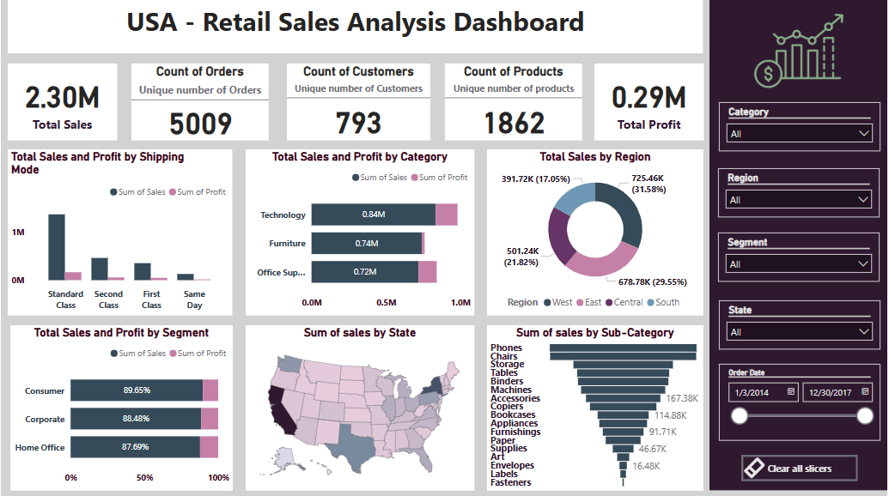

# 🛍️ USA Retail Sales Analysis

A data analysis project examining U.S. retail sales using **Power BI**, **SQL**, and **Python**. This portfolio piece simulates freelance business intelligence work, including KPI reporting, regional breakdowns, time-series trends, and performance visualizations.

---

## 📌 Objective

To explore and analyze retail performance data across the U.S. and demonstrate multi-tool BI skills:
- Create dashboards with **Power BI**
- Derive insights using **SQL**
- Replicate analysis with **Python** for automation and reproducibility

---

## 🔧 Tools & Technologies

| Tool      | Purpose                        |
|-----------|--------------------------------|
| Power BI  | Dashboard visualization        |
| MySQL     | Query-based data exploration   |
| Python    | Scripting, visualizations      |
| Pandas    | Data wrangling                 |
| Seaborn   | Statistical plots              |
| Excel     | Raw dataset                    |

---

## 📂 Project Files

| File Name                       | Description                                      |
|--------------------------------|--------------------------------------------------|
| `Sample-Superstore.xlsx`       | Retail dataset used across all tools            |
| `retail_sales_analysis.sql`    | SQL queries replicating Power BI logic          |
| `retail_analysis.py`           | Python script version of the analysis           |
| `retail_sales_analysis_full.ipynb` | Jupyter Notebook with full visual analysis |
| `Dashboard.PNG`               | Screenshot of Power BI dashboard                |

---

## 📊 Dashboard Snapshot

> Created in **Power BI Desktop**, includes:
> - Total sales, profit, orders
> - Region and category breakdowns
> - Monthly sales trends
> - Sub-category and state performance

---

## 📈 Key Insights

- 📦 **Top Category**: Technology leads in both sales and profit.
- 🌎 **Best Region**: West region dominates in revenue.
- 🧾 **Sales Trend**: Strong end-of-year sales growth visible in the time-series.
- 💰 **Profitability**: High sales ≠ high profit in all segments (e.g., Office Supplies).
- 🔍 **State Breakdown**: California and New York outperform others in both metrics.

---

## 🚀 How to Run the Project

### Python (Jupyter Notebook)
1. Install dependencies: `pip install pandas matplotlib seaborn openpyxl`
2. Open `retail_sales_analysis_full.ipynb` in Jupyter
3. Ensure `Sample-Superstore.xlsx` is in the same folder
4. Run all cells

### SQL
1. Load the Excel file into MySQL (or import it via CSV)
2. Run `retail_sales_analysis.sql` in MySQL Workbench or similar

---

## 📁 Portfolio Context

This project represents **freelance-style BI work** done during a self-learning phase. It simulates business insights generation using open-source datasets, designed to match industry analysis tasks in retail and e-commerce domains.

